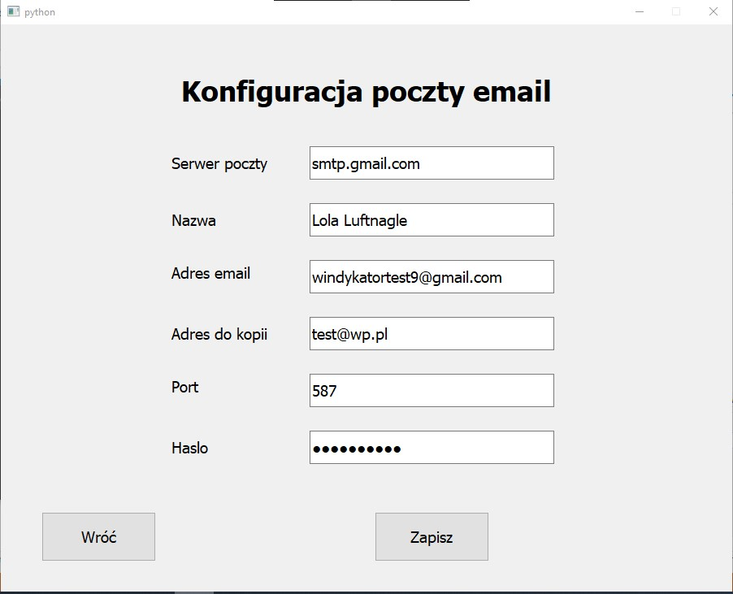
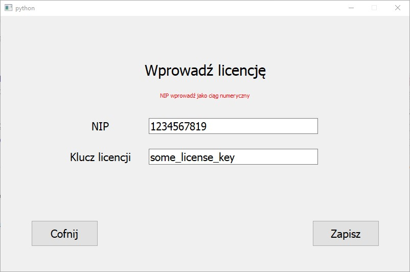
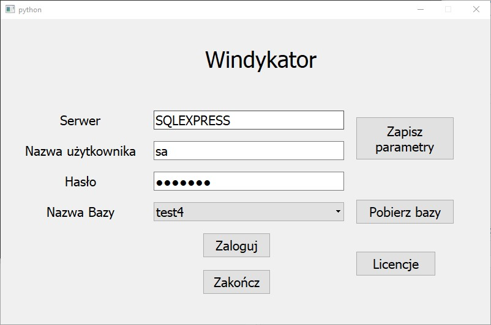
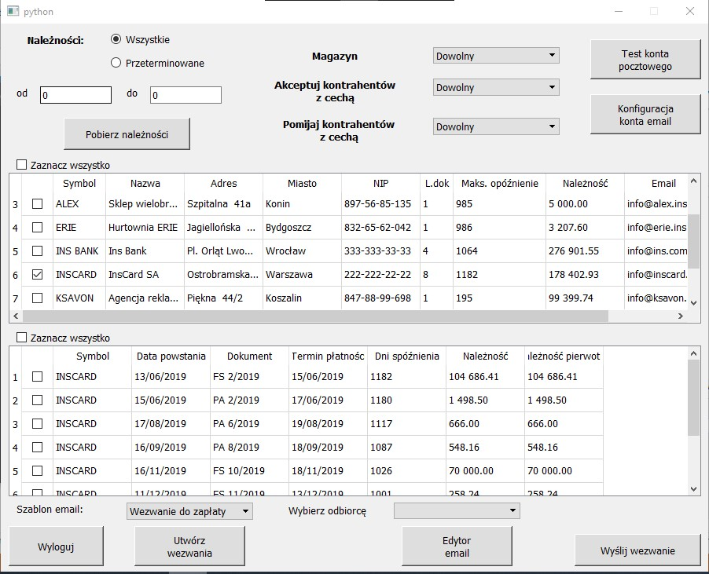
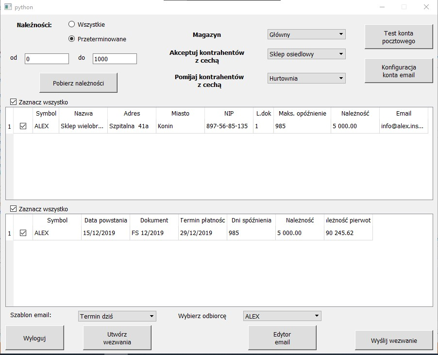
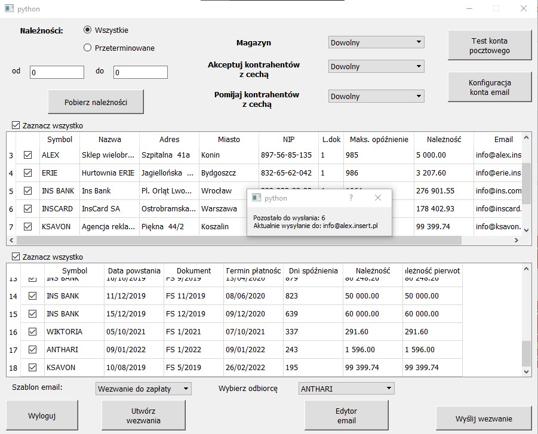
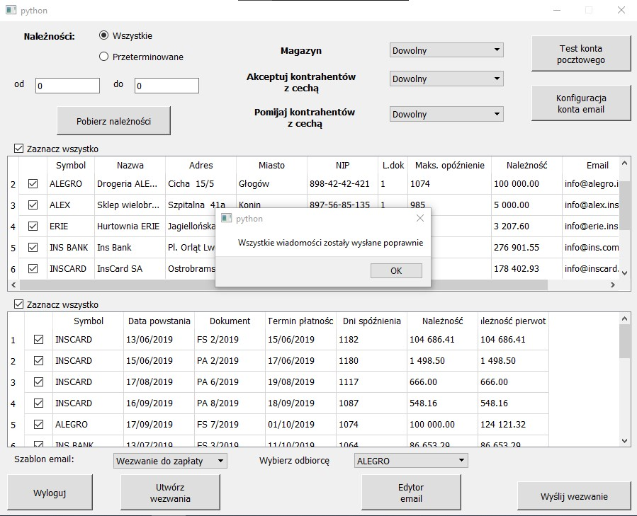
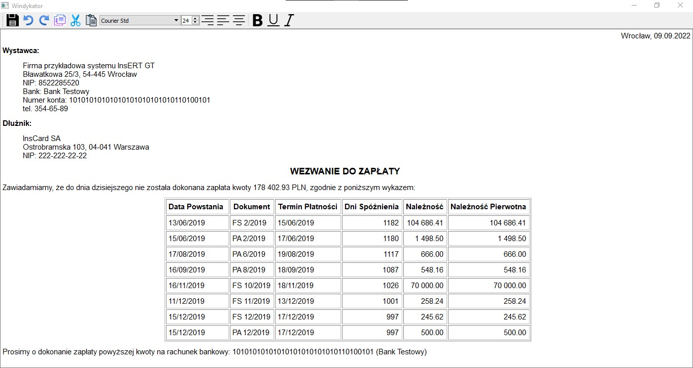

# Windykator

The goal of this project was to recreate the desktop application "Windykator" for Subiekt GT. It has almost all the functionalities that the original has. There are only 2 lacking features - sending SMS and automated processes in the background (which we can do manually). Unfortunately I was unable to push the .exe file because it exceeded the maximum size for one file so you will not be able to run the exe app. To be able to log in - you would need to have your own account for Subiekt's databases.

# Features of the application

All the functionalities are well explained on their official website: https://netsetup.pl/?windykator-dla-subiekta-gt,99. I didn't want to copy and paste it here as it might have been a little too long. There are only 2 missing features which I've already mentioned above.

# Additional information

There are missing certain pieces of code due to the safety reasons. There were some encrypting parts and I didn't want to reveal these information because someone could have already used those ideas in their official projects. If requested - I might share the .exe app depending on the reason. If you don't want to run it on your own device (or you don't have the access to the Subiekt's databases) - you can have a little insight of the app with the images below (or in the Screenshots directory).

# Screenshots

## Email configuration:

## Email example (from the mailbox):

.jpg)

## License:

## Login:

## Main menu:

## Sending messages:

## Template editor:

